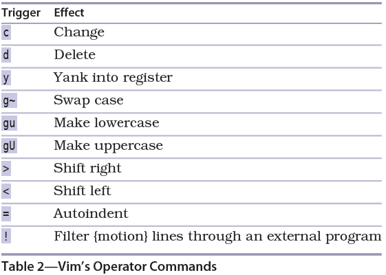

# 技巧12: 操作+操作符 双剑合璧

#### 操作=操作+操作符

> **操作符**:比如`d`(删除),`y`(复制), `c`(删除并进入插入模式)  
> __动作命令__: 操作符的作用范围, 比如`dl`(删除一个字符), `daw`(删除一个单词),`dap`(删除一个段落)

## 大小写转换(`g`)命令,缩进有关操作

  

1. `g~`大小写翻转
2. `gU`单词转大写
> 1. `gUaw` 把当前词转换成大写单词
> 2. `gUap` 把当前段落转换成大写单词段落
> 3. `gUgU`, `gUU`把当前行换成大写

3. `gu`单词转小写
4. `>` 选中的行向右缩进一层
> `>>` 或`>$`向右缩进当前行  
> `><Cr>` 当前行和下一行向右缩进

5. `<` 选中的行向左缩进一层
> `<<` 或`<$`向左缩进当前行
6. `=` 选中的行自动对齐
7. `dd` 删除当前行

   

|上一篇|下一篇|
|:---|---:|
|[技巧11 能够重复,就别用次数](tip11.md)|[技巧13 在插入模式中回退/撤销](../chapter3_insert_mode/tip13.md)|
