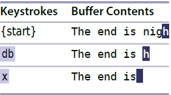
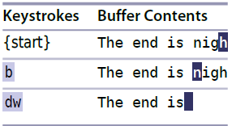
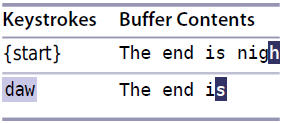

# 技巧9 尽量构造可重复的修改

> 1. Vim 的设计对重复操作进行了优化,我们要利用他,尽可能的构造可重复的修改
> 2. 一般认为,按键越少越好, 感兴趣的可以去 [VimGolf](http://vimgolf.com) 练习

## 比较几种删除单词的操作优劣

> 假设光标在单词的末尾(`h`)

### 1. 反向删除单词 `dbx`

  

`db` 删除贯标起始位置到单词开头位置的内容,但不删除光标所在单词, 补一个`x`删除光标所在字符

### 2. 正向删除 `bdw`

  

`b` 跳到光标所在单词开头, `dw` 删除起始位置直到单词结尾的整个单词,包括起始位置

### 3. `daw`

  

`aw` 指一个文本对象, `daw` 理解为 `delete a word`

###  三种删除方式比较

1. `daw` 好!
2. `daw` 可以使用`.` 重复删除单词
3.  `dbx` 之后使用 `.` 等价于 `x`,
4. `bdw` 之后使用`.` 大多数情况没问题
> 但是如果是从文件的最后一个单词删除, 相当于不断`dw`,`dw`,...而此时的word其实是倒数第二个单词的最后一个字符,所以之后按`.`只能删除一个字符,不是一个单词

   

|上一篇|下一篇|
|:---|---:|
| [技巧8 把撤销的单元切换成块](tip8.md)    | [技巧10 用次数做简单的算术运算](tip10.md)|
