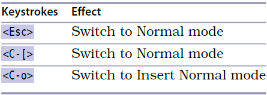

# 技巧14: 返回普通模式

 > 大部分操作应该在普通模式中进行,快速的在普通模式,插入模式直接切换很重要

  

1. `<C-[>` == `<Esc>` ,退回到普通模式

### 插入-普通模式

> 有的时候,只想在普通模式下进行一个操作,之后立刻跳回来继续插入模式,该怎么方便的操作? 
> **使用插入-普通模式!**

#### `<C-o>` 进入插入普通模式

1. **`<C-o>zz`**:在插入模式中使用`zz`将当前操作行调整至屏幕中间,方便观察下面的行,继续插入操作

   

|上一篇|下一篇|
|:---|---:|
|[技巧13 在插入模式中回退/撤销](tip13.md)|[技巧15 不离开插入模式, 粘贴寄存器中的文本](tip15.md)|
