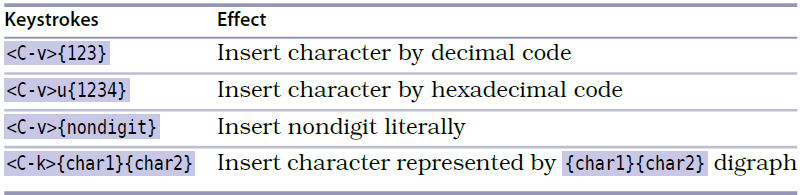

# 技巧17: 用字符编码插入非常用字符

> 1. 如果知道一些特殊字符的编码，可以直接通过输入编码从键盘敲入这些字符，不需要借助外部的输入法或者手动复制粘贴
> 2. atom 编辑器vim-mode不支持

### 例子

  

1. `<C-v>{123}` 按16进制插入字符,实际插入的是`{`
2. `<C-v>u{1234}` 按Unicode编码插入字符,实际插入的是`ሴ`
3. `<C-v><Cr>` 之后插入`回车键`本身表达的内容`^M`

#### `ga` 显示光标所在字符的`Ascii码,十进制编码,十六进制编码`

   

|上一篇|下一篇|
|:---|---:|
|[技巧16 随时随地做运算](tip16.md)|[技巧18 用二合字母(digraph)插入非常用字符](tip18.md)|
