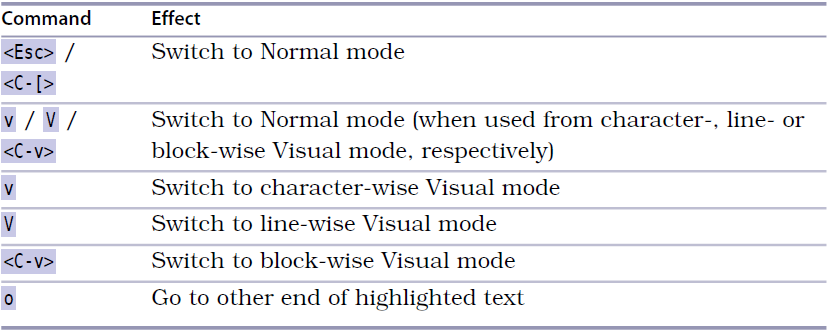
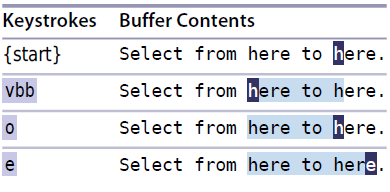

# 技巧21: 选择高亮区域
> 介绍如果进入可视模式的三种子模式(文本选中, 行选中, 块选中)

### 激活可视模式

  

1. `v`进入面向字符的可视模式
> `gv` 重新选择上一次可视命令选中的位置,如果原来的单词/行被删除,显示可能有问题

2. `V`进入面向行的可视模式
3. `<C-v>`进入面向列的可视模式

### 在可是模式间切换

  

1. `o` 在可视模式中光标移动到选中区域的另一端点, 见下面的例子

### 切换选区的活动端

  

   

|上一篇|下一篇|
|:---|---:|
| [技巧20 深入理解可视模式](tip20.md)|[技巧22 重复执行面向行的可视命令](tip22.md)|
