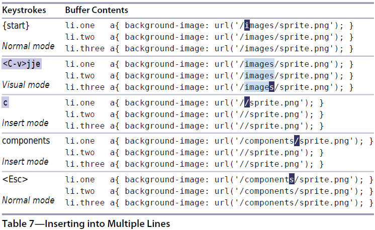

# 技巧25: 修改列文本

### 例子: 替换CSS中的图片路径

> 将 `/images/` 替换成 `/components/`

  

1. `<C-v>jje`: 进入列可视模式(`<C-v>`), 选中三行(`jj`), 每列选中到单词结尾(`e`)
2. `c`: 删除选中文本
3. `<Esc>`: 显示剩下两行的修改结果

   

|上一篇|下一篇|
|:---|---:|
|[技巧24 用面向__列块__的可视模式编辑](tip24.md)|[技巧26 在长短不一的高亮块中添加文本](tip26.md)|
