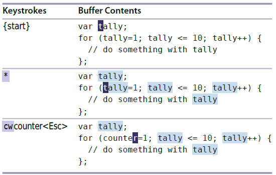

# 技巧33： 把当前单词插入到命令行

> 怎么快速的把当前光标所在的单词插入正在编辑的命令行中？`<C-r><C-w>`

### 例子：变量重命名（字符串替换）

> 将所有的`tally`替换成`counter`

  

1. 将光标移动到`tally`字符串上面后，用`*`相当于 `/\<C-r><C-w\><CR>`（查找光标所在单词的下一个位置）

2. 进行完上图的操作后，直接按`:%s//<C-r><C-w>/g`即可完成替换（因为此时光标在`counter`上，所所以指令等价于`:%s//counter/g`
> 因为`*`命令，使得替换命令的查找域为空（理论上是`%s/tally/counter/g`), 具体原因看[技巧90]()

   

|上一篇|下一篇|
|:---|---:|
|[技巧32 自动补全Ex命令](tip32.md)|[技巧34 回溯历史命令](tip34.md)|
