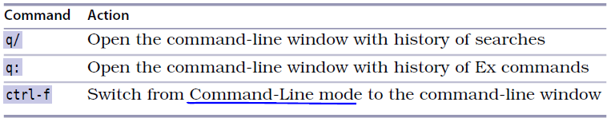

# 技巧34： 回溯历史命令

> 回溯之前之执行过的命令的两种方式：
> > 1. 用光标键回滚
> > 2. 调出命令行窗口查看历史命令

1. 先按`:`，然后保持提示符为空下按`<Up>`,则刚刚执行的命令会覆盖在命令行上，`<Down>`键反向
> 1. 对于查找命令（普通模式下按`/`进入），vim也保存其历史记录，按`<Up>`,`<Down>`键切换
> 2. 命令行下历史记录的查找可以用`<C-p>`, `<C-n>`来分别替代`<Up>`,`<Down>`键，好处是手指移动距离短，坏处是没有`<Up>`,`<Down>`键对历史记录过滤的功能
> >  将两者结合：在vimrc中添加下面两行，把命令行模式下的`<C-p>`, `<C-n>`映射成`<Up>`,`<Down>`
> >  `cnoremap <C-p> <Up>`
> >  `cnoremap <C-n> <Down>`

2. 设置vimrc `set history=200`可以修改vim保存200条历史命令记录

### 命令行窗口

1. `q:`进入命令行窗口
> 1. 在命令行历史窗口中，`j`，`k`上下移动
> 2. 命令行历史窗口内支持`/`,`?`查找命令
> 3. 命令行历史窗口内按回车键执行光标所在命令
> 4. 窗口打开后拥有焦点，`:q`退出

2. 进入命令行模式的3中方法：见下图

  

### 例子： **利用命令行窗口合并历史命令**

  

   

|上一篇|下一篇|
|:---|---:|
| [技巧33 把当前单词插入到命令行](tip33.md)|[技巧35 运行Shell命令](tip35.md)|
