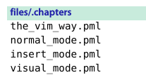

# 技巧37： 用参数列表将缓冲区分组

> 1. 参数列表易于管理，将其分组易于访问
> 2. `:argdo` 用法

1. 假设我们已经使用`vim *.vim`打开了一些txt文件

2. `:args` 查看参数列表
>   <br>
> `[]`覆盖的文件表明**活动文件** <br>
> `:args` 比 `:ls`的显示简陋 <br>

3. `:args {arglist}` 可以**指定**参数列表的内容，例子如下:
>   
> `{arglist}` 也可是通配符，比如`:args *.txt`,对于打开大量文件有优势

## 用Glob模式指定文件

> 1. `*` 是一个通配符，用于匹配0个或多个字符，**不递归**
> 2. `**` 是一个通配符，用于匹配0个或多个字符，**递归**

1. **Glob模式**:使用两种通配符加上部分文件名或目录名，构造的用以匹配文件名的模式
> 几个例子: <br>
> 

2. `:args **/*.js **/*.css`: 构造一个只包含`.js`和`.css`的文件

## 用``` 反引号(``) ``` 来指定文件

1. 假设要打开的文件名已经存放在一个文本文件中:
>  

2. 使用``:args `cat .chapters` ``即可打开这4个pml文件

## 参数列表 vs 缓冲区列表

1. 参数列表更容易管理, 对于**缓冲区分组** 问题更容易管理
2. `:args {arglist}` 一下就可清空缓冲区，并设置新的缓冲区列表

3. 缓冲区列表像`桌面(desktop)`，乱七八糟；参数列表像`工作区（workspace）`, 只在需要扩展空间时用到
> [技巧69](),[技巧96]() 有参数列表的例子


<br>  

|上一篇|下一篇|
|:---|---:|
|[技巧36 用缓冲区列表管理打开的文件](tip36.md)|[技巧38 管理隐藏缓冲区](tip38.md)|
