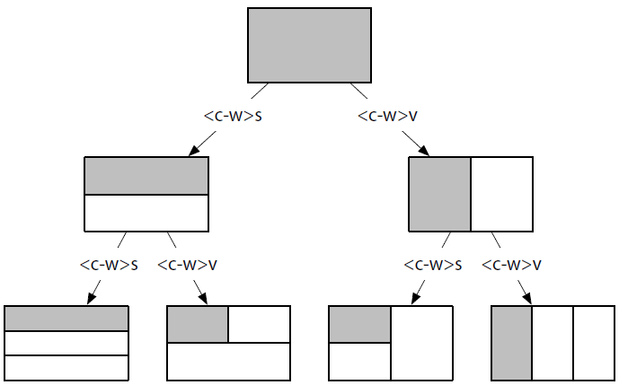
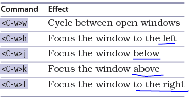
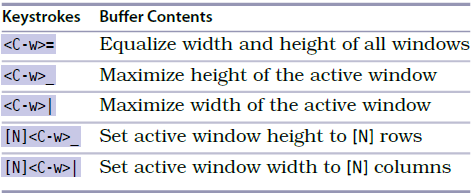

# 技巧39： 将工作去切分成窗口

> vim 的窗口可以并排显示多个缓冲区

## 创建切分窗口

> 效果见下图， `阴影`表示当前选中的窗口

  

1. `<C-w>v` 垂直(_**v**ertical_)平分当前窗口
> `:sp` 等价于 `<C-w>v`
2. `<C-w>s` 水平(_**s**tandard_)平分当前窗口
> `:vsp` 等价于 `<C-w>s`

3. 也可以指定分割窗口后缓冲区到底插入的是哪个文件的缓冲区
> `:vsp filename`, `:sp filename`

  

## 在窗口间切换

> 加入我们打开了多个窗口，咋么切换正在编辑的窗口？见下图：

  

1. `<C-w>w` 在窗口间循环切换
> `<C-w><C-w>` 等价于 `<C-w>w`,所以可以按住`Ctrl`键，之后连按2次`w`键即可切换窗口
2. `<C-w>h` 切换到左边的窗口
2. `<C-w>j` 切换到下边的窗口
2. `<C-w>k` 切换到上边的窗口
2. `<C-w>l` 切换到下边的窗口

## 关闭窗口

  

1. `:close` 关闭所有活动窗口
2. `:only` 关闭活动窗口以外的窗口

## 改变窗口大小和重新排列窗口

  

1. `<C-w>=` 是所有窗口等宽等高
2. `<C-w>_` 最大化活动窗口高度
3. `<C-w>|` 最大化活动窗口宽度

   

|上一篇|下一篇|
|:---|---:|
|[技巧38 管理隐藏缓冲区](tip38.md)|[技巧40 使用标签页将窗口分组](tip40.md)|
