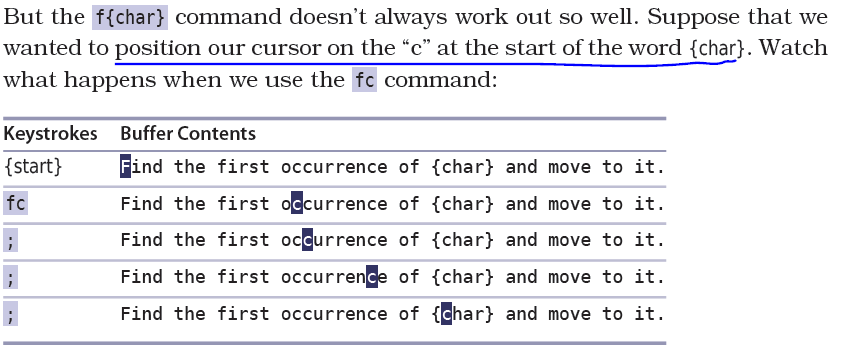
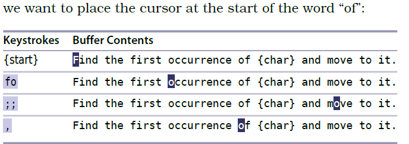

# 技巧49： 对字符串进行查找

#### `f{char}`:行内搜索字符，跳到该字符的第一次出现位置

> 没有搜到则光标不移动  

  

> `F{char}` 和`f{char}` 搜索方向相反  

  

> 搜索到第一个字符后按`;`继续向后查找改行的下一个字符出现位置 

  

> 按`,`向前查找改行的下一个字符出现位置

  

#### `t{char}`，`T{char}`

向后查找**直到**字符`{char}`,光标停在前一个字符（如果是`T{char}`，则光标停在后一个字符）

  

   

|上一篇|下一篇|
|:---|---:|
|[技巧48 基于单词移动](tip48.md)|[技巧50 通过查找进行移动](tip50.md)|
