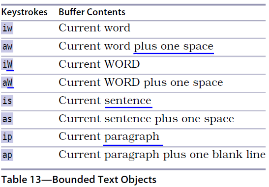
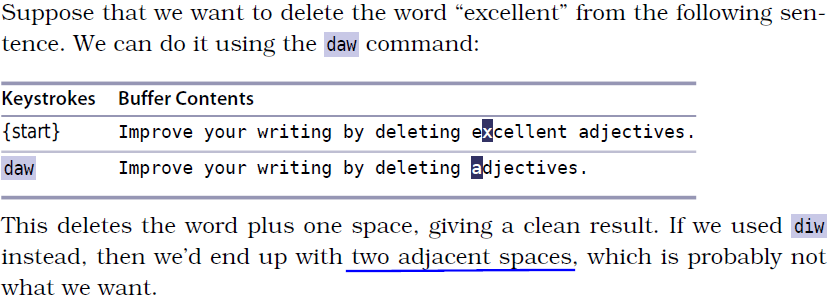
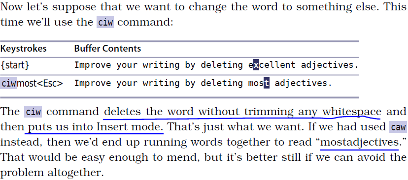

# 技巧52： 删除周边，修改内部

> vim的`文本对象`分为两类
> 1. `分隔符文本对象`：对象内部的文本, 以配对的符号作为开始和结束, 比如`vit`选中XML标签内的内容
> 2. `范围文本对象`：对象周围的文本, 像单词、句子、段落这样以文本结构的范围进行界定，比如`viw`选中光标所在单词

### 例子：选中单词、句子、段落

  

#### `iw` vs `aw`

1. `iw` 包含当前光标所在单词的第一个字符到最后一个字符
2. `aw` 包含`iw`的文本连同前一个 **或** 后一个空格

### 例子：删除单词
> `daw`好！

  

1. `daw` 符合我们想要的
2. `diw` 不好！ 因为不会删除空格，导致adjectives之前有2个空格

### 例子：删除单词并进入插入模式继续输入
> `ciw` 好！

  

1. `ciw` 正好！
2. `caw` 会多删一个空格，导致开始进入插入模式的时候会变成`mostadjectives`

`d{motion}`: 和`aw`, `as`, `ap`搭配好
`c{motion}`: 和`iw`, `is`, `ip`搭配好

   

|上一篇|下一篇|
|:---|---:|
|[技巧51 用精确的文本对象选择选取](tip51.md)|[技巧53 设置位置标记，以便快速跳回](tip53.md)|
