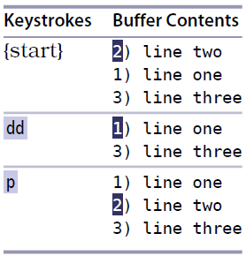
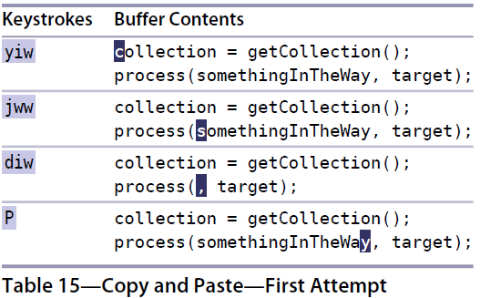

# 技巧59： 用无名寄存器实现删除、复制和粘帖操作
> vim 复制、剪切、粘贴的例子

### 例子：调换连续的2个字符
> 空格打的太快导致单词打错，调换' '和'l'

  

1. `F `从后向前查找第一个空格
2. `x` 删除光标所在字符（并把删除的字符放到`无名寄存器`）
3. `p`将无名寄存器的内容粘贴到光标后

> `xp` 是调换两个连续的字符（没必要专门记忆）

### 例子2：调换文本`行`

  

1. `dd`删除光标所在行（并把删除的字符放到`无名寄存器`）
2. `p`将无名寄存器的内容粘贴到光标下一行

> `ddp` 交换2个连续的行（没必要专门记忆）

### 例子3：复制文本行

  

1. `yy`复制光标所在行（并把复制的字符放到`无名寄存器`）
2. `p`将无名寄存器的内容粘贴到光标下一行

### 例子4：替换单词，但是失败了 (**这个例子后面几个技巧都提到，注意一下**)
> 希望将`somethingInTheWay`替换成`collection`

  

1. `yiw` 复制光标所在单词
2. `jww` 跳到`somethingInTheWay`
3. `diw` 删除光标所在单词
4. `P` 将未命名寄存器的内容粘贴到光标处

**粘贴失败！**

1. 失败原因: `diw`之后无名寄存器已经变成`somethingInTheWay`了
2. **解决方式**：用`"0P`替代`P`
> `"0` 是复制专用寄存器， 只有`y`操作会改变其中的值; `"0P"` 将`复制专用寄存器`的值粘贴到光标`前`

  gg

|上一篇|下一篇|
|:---|---:|
|[技巧58 用全局位置标记在文件间快速跳转](tip58.md)|[技巧60 深入理解vim寄存器](tip60.md)|
