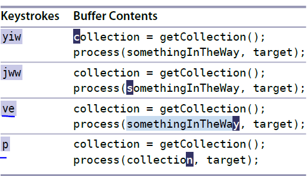

# 技巧61： 用寄存器中的内容替换高亮选取的文本

> 在可视模式下使用粘贴命令

### 例子：替换单词（还是[技巧59](tip59.md)的例子）

  

1. `ve` 选中单词
2. `p`将选中的单词替换成未命名寄存器中的文本
3. **这次命令结束后未命名寄存器中的内容会被替换成somethingInTheWay**
> 如果按`u`撤销操作后再重按`p`不会有任何效果

### 例子2：交换单词`chips`和`fish`

  

1. `de`删除当前单词
2. `p`把删除的单词粘贴到光标后面
3. `mm`在光标处设置标记为`m`
4. `` `m``跳到标记为`m`的位置
5. `c3w`，然后再重新输入单词也可以

   

|上一篇|下一篇|
|:---|---:|
|[技巧60 深入理解vim寄存器](tip60.md)|[技巧62 把寄存器中的内容粘贴出来](tip62.md)|
