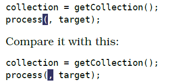

# 技巧62： 把寄存器中的内容粘贴出来
> 普通模式下的粘贴命令，待插入的文本不同，粘贴指令的执行效果也不同 
> 面向行和面向字符的粘贴指令效果不同

1. `xp`交换2个字符顺序
2. `ddp`交换2行顺序

1. `p`将文本粘贴到光标之前
2. `P`将文本粘贴到光标之后

> 1. `前`和`后`有两种理解：前一行/后一行，前一列/后一列
> 2. 面向`行`的删除和复制：粘贴操作粘贴到光标的`前一行和后一行`
> 3. 面向`字符`的删除和复制：粘贴操作粘贴到光标的`前一字符和后一字符`

## 粘贴面向字符的区域

### 例子：将寄存器中的单词插入光标位置

  

1. 上一个用`p`，下一个用`P`
2. `p`和`P`经常会用错，导致`puP`或`Pup`的按键序列出现
3. 好的方法是进入插入模式后按`<C-r>"`或`<C-r>0`来粘贴

### 例子1：使用插入模式来替换单词（还是[技巧59](tip59.md)的例子）

  

## 粘贴面向行的区域

比面向字符的粘贴更直观

#### `gp` 类似与`p`， 区别在于粘贴后光标位于插入的文本的末尾（`p`位于开头）
#### `gP` 类似与`P`， 区别在于粘贴后光标位于插入的文本的末尾（`P`位于开头）

### 例子：复制表格的html

  

   

|上一篇|下一篇|
|:---|---:|
|[技巧61 用寄存器中的内容替换高亮选取的文本](tip61.md)|[技巧63 与系统粘贴板进行交互](tip63.md)|
