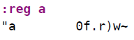
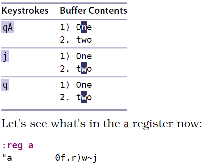

# 技巧68： 给宏追加命令
> 如果我们录制完了一个宏，但是发现少加了一些命令，怎么办？
> 1. **在宏的结尾处追加**
> 2. **如果缺少的命令在宏的开始或中间，则没法解决，必须重新录制宏**

### 例子：数据格式化 (同[技巧67](tip67.md)的例子)
> 改变排序标号，首字母大写

假设我们录制完毕后如下：

  

发现少了一个`j`（移到下一行）,查看一下现在的宏a的内容：

  

则进行补救，在宏a的结尾处添加：

  

1. `qa` 开始录制宏a，会覆盖之前宏a的内容
2. `qA` 将命令添加到宏a的后面，不会覆盖原来的宏a内容

   

|上一篇|下一篇|
|:---|---:|
|[技巧67 在连续的文本行上重复修改](tip67.md)|[技巧69 在一组文件中执行宏](tip69.md)|
