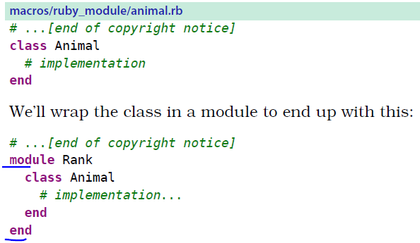
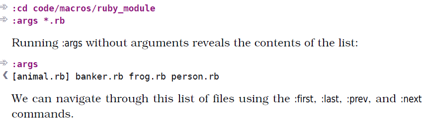

# 技巧69： 在一组文件中执行宏
> 介绍如何将一个宏作用在一组文件shang 
> 同样可以串行或并行执行

### 例子：给每个 class 添加外部的 module
> 如下图，我们希望下图的上半部分变成下图的下半部分
>   

#### 1. 建立目标文件列表/打开所有的目标文件

  

1. `:args *.rb` 打开目标文件
2. `:args` 显示参数列表的内容

#### 2. 录制宏

  
  

1. `:first` 先把光标移到参数列表的第一个文件
2. `gg` 移动到第一行
3. `/class<CR>` 查找class
4. `0` 移动到行的第一列
5. `j>G` 先把光标移动到下一行（`j`），然后将光标所在行到最后一行（`G`）增加一层缩进（`>`）
6. `Go` 跳到最后一行，并在下面插入一行

> 做完第一个的修改不要保存（`:w`),下面说明原因

#### 3. 方法一：并行方式执行宏

1. 撤销对第一个文件的修改`:edit!`
2. 对参数列表的所有文件执行宏`:argdo normal @a`
3. 保存`:wall`
> **之所以录制宏的时候不保存、3.1先撤销修改，是为了防止第一个文件被执行2次**

#### 3. 方法二：串行方式执行宏

1. 添加宏的内容到结尾 
>   

2. 串行执行宏 `100@`
> 也可以是`10@a`，只要大于文件个数就行，超过的`:next`命令会失败，然后宏自动中止

3. 保存文件`:argdo write` (等价于`:wall`,保存参数列表的所有文件的修改)
> 可以将3.1添加的宏改成`:wnext`, 则3.3可以省略。`:wnext`等价于先保存当前文件修改，再移动到参数列表的下一个文件

   

|上一篇|下一篇|
|:---|---:|
|[技巧68 给宏追加命令](tip68.md)|[技巧70 用迭代求值的方式给列表编号](tip70.md)|
