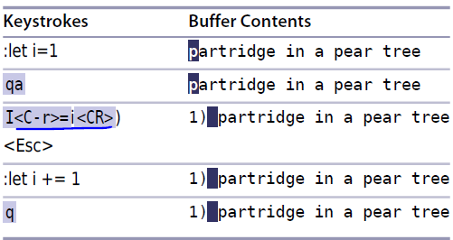
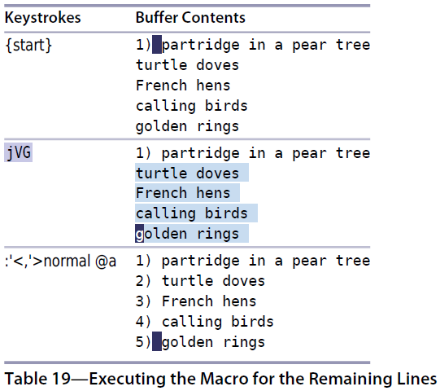

# 技巧70： 用迭代求值的方式给列表编号
> 在使用宏的时候如何插入一个变化（递增）的数值

### 例子：给每行加上编号
> 希望把下图上面的内容变成下图下面的内容 
>    

解决方法：通过`:let`创建变量，每次调用宏的时候增加1,使用该变量显示行号，具体过程如下图：

1. 录制宏
>   

2. 并行回放宏
>    

说明：

1. `:let i=0` 设置变量
2. `:echo i` 打印变量
3. `<C-r>=i<CR>` 在插入模式中使用表达式寄存器,并将值`i`插入

#### (思考题)解法2：使用复制、粘贴+`<C-a>`解决
> 这里我只贴代码和简要注释

1. `gg0`+`i1) <Esc>` 制作第一个
2. `qa`+`0`＋`yt `+`j0`+`i <ESC>`+`0`+`P`+`0<C-a>`+`q` 录制宏
3. `99@a` 回放宏

   

|上一篇|下一篇|
|:---|---:|
|[技巧69 在一组文件中执行宏](tip69.md)|[技巧71 编辑宏的内容](tip71.md)|
