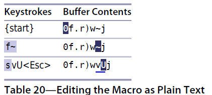

# 技巧71： 编辑宏的内容
> 1. [技巧68](tip68.md)说明在宏结尾添加 命令容易
> 2. 本技巧说明如何像编辑普通文本一样编辑宏内容

### 例子：更改排序编号的样式
> 1. 把下图的文件改成`1) One`的形式 （**注意下图有的首字母大写，有的还未大写**) 
> 2. 假设现在宏a的内容是`0f.r)w~j` 
>   

#### 解法：把宏a的内容粘贴到文档中，然后修改，之后覆盖回宏a的寄存器中

#### 步骤1：将宏粘贴到 文本

`:put a`
> 1. `:put a` 把 寄存器a的内容插入到`光标所在的下一行`
> 2. 比`"ap` 好，因为如果寄存器a中的是面向字符的内容，则会插入光标后一个字符，可能会和原来的代码混在一起，`:put a`保证在独立的一行

#### 步骤2：编辑宏
  

1. `~`把光标所在的字符大小写取反
2. `U`把光标所在的字符变成大写

#### 步骤3：将宏从文档复制回寄存器

`0`+`"ay$`+`dd`
> `"add`也能达到类似效果，但是代码最后会多一个结尾字符`^J`,为了保险起见，使用先复制，再删除的方法

   

|上一篇|下一篇|
|:---|---:|
|[技巧70 用迭代求值的方式给列表编号](tip70.md)|[技巧72 调整查找模式的大小写敏感性](../../part5_pattern/chapter12_match/tip72.md)|
