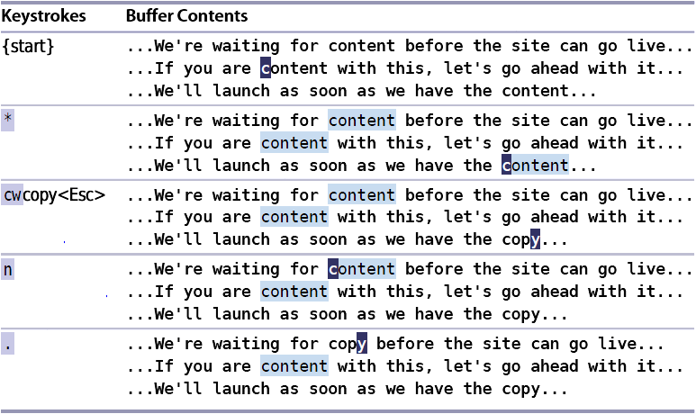

# 技巧5: 查找并手动替换

## 基本替换指令

#### `:%s/content/copy/g`将文档中所有的`content`字符串替换为`copy`

> 考虑到`content`这个单词有的时候是名词（`内容`），有点时候是（`满足的`）,我们希望有的地方替换成copy，有的地方不替换，由编辑者每次确认是否要替换，该怎么修改指令呢？

### 改进替换指令1：连续查找+有的时候使用替换操作

1. `*`：查找光标所在单词的下一次出现
2. `#`:查找光标所在单词的上一次出现
3. `cw`:删除光标开始的字符直到单词结尾

### 例子：连续查找+有的时候使用替换操作
  

### 改进替换指令2：加强基本替换操作

#### `:s%/content/copy/gc`:将文档中的`content`字符串替换为`copy`, 每次替换前由用户确认是否替换

   

|上一篇|下一篇|
|:---|---:|
|[技巧4 执行、重复、回退](tip4.md)|[技巧6 结识`.`范式](tip6.md)|
