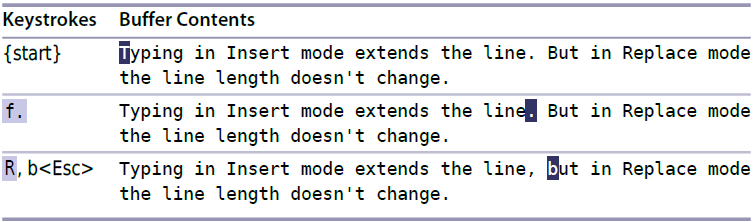

# 技巧19: 使用替换模式替换已有文本

> 替换模式类似与插入模式,但是每次插入字符的时候覆盖后面的字符

### 例子: 替换文本

> 将 `line. But` 替换成 `line, but`

  

1. `R` 进入替换模式,直到`<Esc>`键按下后退出

> `gR` 进入 `虚拟替换模式`:加入`制表符`占4列宽,则在制表符开始时插入前三个不会删除原来的制表符,插入第4个字符后制表符才被替换

2. `r` 替换光标所在 **字符**

   

|上一篇|下一篇|
|:---|---:|
|[技巧18 用二合字母(digraph)插入非常用字符](tip18.md)|[技巧20 深入理解可视模式](../chapter4_visual_mode/tip20.md)|
