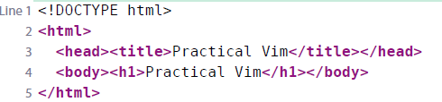
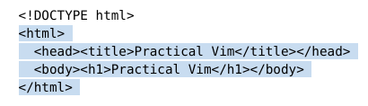
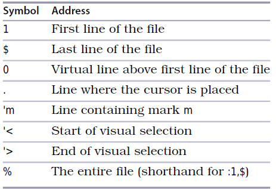

# 技巧28： 在一行或多个连续行上执行命令

### 例子：使用命令行打印代码

  

### 用行号做地址
1. `:1` 跳到第一行
2. `:print` 将第一行的内容打印到命令行上显示
3. `:$` 跳到最后一行
4. `p` 等于`:print`

### 用地址指定一个范围
5. `:5p` 光标移动到第5行并打印改行
6. `:2,5p` 打印第二到第5行的内容(**含第二行和第五行**)
7. `:.,$p` 打印当前行到最后一行的内容（`.`代表当前行，`$`代表最后一行）
8. `%p` 打印所有行
9. `%s/Practical/iampkuhz/` 把所有的`Practical` 单词替换成 `iampkuhz`

### 用高亮选取指定范围

> 假设已经在可视模式下选中下面的文本

  

10. 在上面的可视选取选中后按`:`，则命令行会预先填充`:'<,'>`
> `'<`代表高亮选区的第一行, `'>`代表高亮选区的最后一行
11. `:/<html>/,/<\/html>/p`, 在本例中等价于`2,5p`
> `/<html>/`表示的是 `<html>` 所在地址， `/<\/html>/`表示的是 `</html>`所在地址（含有转义字符）
12. `:/<html>/+1,/<\/html>/-1p`, 在本例中等价于`2+1,5-1p`,等价于`3,4p`

### Ex命令的地址和范围符号总结

  

   

|上一篇|下一篇|
|:---|---:|
|[技巧27 结识Vim的命令行模式](tip27.md)|[技巧29 使用`:t` `:m` 进行复制和移动行](tip29.md)|
