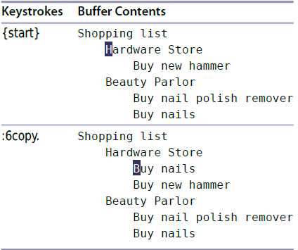
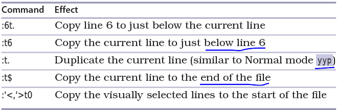
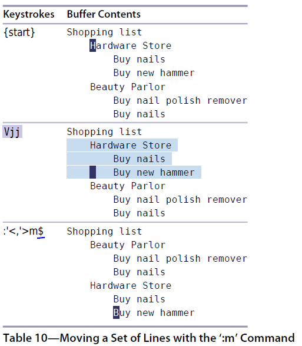

# 技巧29： 使用`:t` `:m` 进行复制和移动行

> 1. `:t` 是 `:copy` 的缩写, 也等价于`:co`， 可以把多行复制到其他位置
> 2. `:m` 是 `:move` 的缩写，把多行移动到其他位置

### 例子： 复制/移动购物清单

  

### 复制行

1. `：6copy.` 等价于 `:6co.` 等价于 `:6t.`： 将第3行复制到当前行下方, 效果见下图  
  

2. 其他复制的例子见下表  
  

#### `:t.` vs `yyp`
 1. 两者都是把当前行复制一份放到下面一行
 2. `:t.` 不使用寄存器，`yyp`使用

#### 移动行

1. `Vjj`选中待移动区域后`:m$`将其插入到文件结尾
  

> 也可以`Vjj`选中后按`dGp` (`d`删除选中区域，`G`跳到最后一行，`p`粘贴内容)

   

|上一篇|下一篇|
|:---|---:|
|[技巧28 在一行或多个连续行上执行命令](tip28.md)|[技巧30 在指定范围上执行普通模式命令](tip30.md)|
