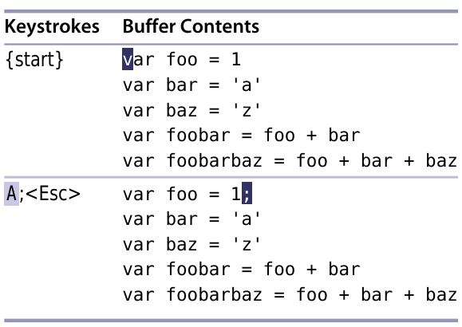
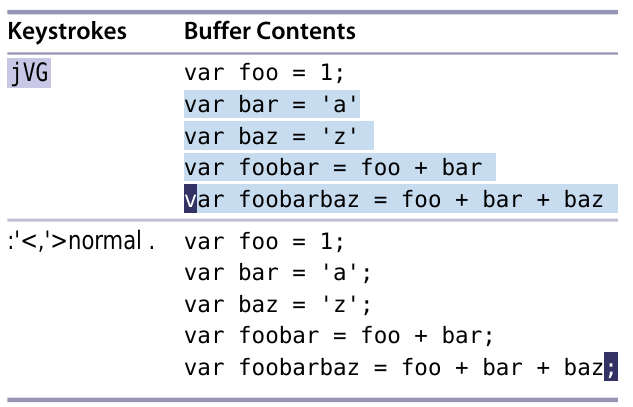

# 技巧30： 在指定范围上执行普通模式命令

> `:normal {oprator}`可以在一系列连续行上执行一条普通模式命令， 结合`.`或宏命令可以花费很少的按键来完成大量重复性的任务

### 例子：给文件的每一行末尾添加`;`字符

> 在`技巧2`中，如果我们想在50行的每一行的末尾加上`;`,则我们需要`A;<Esc>j.j.j.j.`...按3×+2*49=101次键盘，下面的例子只需要几次按键即可完成此任务

  

  

1. `:'<,'>normal .` ： 对高亮选取的每一行，执行`.`命令
> 1. `:%normal A;` 表示对每一行,在结尾处插入`;`
> 2. `:%normal i//` 表示对每一行，在最前面插入`//` （注释文件）

   

|上一篇|下一篇|
|:---|---:|
| [技巧29 使用`:t` `:m` 进行复制和移动行](tip29.md)|[技巧31 重复上次的Ex命令](tip31.md)|
