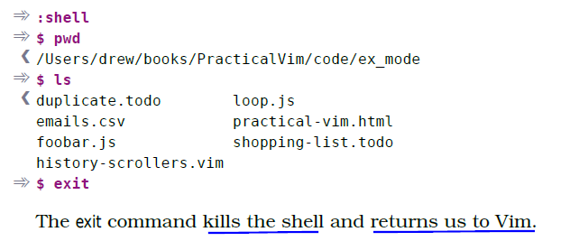

# 技巧35： 运行Shell命令

> vim 内可以调用shell命令

> **好处:**
>> 1. 可以把缓冲区的内容作为标准输入发送给标准输出发送给外部命令
>> 2. 把外部命令的标准输入放到缓冲区

1. `:ls`,`:!ls` 不同，前者是vim命令，显示缓冲区内容；后者调用shell的`ls`
2. `:!ruby %` 调用ruby执行当前文件

### `:shell` 启动一个交互式的shell会话
  

## 把缓冲区的内容作为标准输出或输入

1. `:read !{cmd}` 把标准输出重定向到缓冲区
2. `:write !{cmd}` 把缓冲区的内容作为shell命令的标准输入
3. `:write! sh` 把缓冲区的内容写到`sh`这个文件里面

### 例子： 使用sort排序

> 将记录按照姓氏排序

  

1. `2,$!sort -t',' -k2`即可按照姓氏排序上图的条目
> `2,$`表示排序候选是第二行到最后一行
> `-t','`表示按`,`分割字段
> `-k2` 表示排序字段为第二列

2. 如果排序的是当前文档且光标就在第二行，直接使用`!G` (等价于`:.,$!`)

   

|上一篇|下一篇|
|:---|---:|
| [技巧34 回溯历史命令](tip34.md)|[技巧36 用缓冲区列表管理打开的文件](../../part2_file/chapter6_multi_files/tip36.md)|
