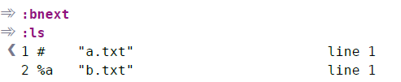

# 技巧36： 用缓冲区列表管理打开的文件

> vim 的一次编辑会话可以打开多个文件，vim的缓冲区列表对文件进行管理

## 文件 vs 缓冲区

1. vim中`正在编辑一个文件` 其实是`正在编辑一个缓冲区`
2. 文件存在磁盘，缓冲区存在内存

## 查看/切换缓冲区列表

  

1. `vim *.txt`假设打开2个文件文件, 会默认只显示第一个文件

2. `:ls`显示缓冲区的所有文件，其中：
> 1. `%`表明当前窗口中可见的缓冲区
> 2. `#`表示轮换文件，即上一次打开的文件

3. `:bnext` 切换到下一个文件的缓冲区
> 1. `:bprev` 切换到上一次的文件缓冲区
> 2. `:bfirst` 切换到缓冲区列表中第一个文件的缓冲区
> 3. `:blast` 切换到缓冲区列表中最后一个文件的缓冲区
> 4. `<C-^>` 在当前文件和轮换文件间快速切换
> 5. `:buffer N` 跳到编号为`N`的缓冲区

4. `:bufdo` 允许在打开的所有缓冲区中执行Ex命令（作用在多个文件上）
5. `:argdo` 比`:bufdo`实用（后面讲）

## 删除缓冲区

1. `:bdelete` 删除缓冲区  
> `:bdelete 1 2 4`:删除编号为1,2,4的缓冲区

**vim 内置的缓冲区管理不灵活，之后的几个技巧介绍如何将缓冲区进行自定义的组织、分割**

   

|上一篇|下一篇|
|:---|---:|
|[技巧35 运行Shell命令](../../part1_pattern/chapter5_ex_mode/tip35.md)|[技巧37 用参数列表将缓冲区分组](tip37.md)|
