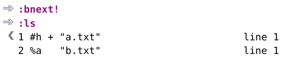

# 技巧38： 管理隐藏缓冲区

> 1. vim 对修改过的缓冲区会区别对待，放在意外退出
> 2. 本节介绍如何隐藏已修改的缓冲区
> 3. 介绍如何在退出Vim时处理隐藏缓冲区

### 例子：修改and切换缓冲区

1. 打开文件
>   

2. 输入`Go`（跳到最后一行，后面插入一个空行），不保存后输入`:ls`发现第一个文件多一个`+`，说明有未保存的修改(保存后`+`消失)
>   

3. 如果不保存修改就直接切换缓冲区，会报错：
>   

4. 如果输入`:bn!`可以强制切换，但是显示不一样：
>   
> 标记`h`表示他是`隐藏缓冲区（hidden）`  
> 标记`a`表示他是`活动缓冲区(active)`

## 在退出时处理隐藏缓冲区

> 下图显示所有的处理缓冲区的策略

  

1. 如果有隐藏缓冲区，则退出时，会提示下图，并把当前窗口切换为第一个修改的隐藏缓冲区：
>   

2. 如果需要保存当前缓冲区，则执行`:write`把当前缓冲区保存到文件
> `:edit!` 则放弃更改

3. 如果有多个隐藏缓冲区被修改，则每处理一个（`:write`或`:edit!`)之后下一个自动跳到屏幕上
4. `:qall!` 放弃所有的隐藏缓冲区修改，直接退出

5. `:wall` 保存所有的缓冲区修改
> `:argdo write` 也可以保存所有的缓冲区修改

#### 运行`:argdo` 或`:bufdo`之前，最好启用`hidden`

1. 否则在执行下图的指令时，假如第二条`{cmd}`指令修改了缓冲区，则第三条指令不能切换，导致后面的指令都停止
2. `hidden`参数强制不提示

   

|上一篇|下一篇|
|:---|---:|
|[技巧37 用参数列表将缓冲区分组](tip37.md)|[技巧39 将工作区切分成窗口](tip39.md)|
