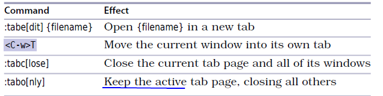
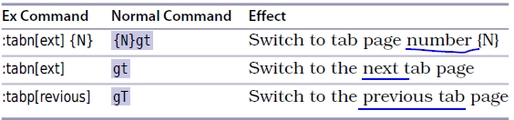

# 技巧40： 用标签页将窗口分组

> vim里 可以用标签页把窗口组织到一系列工作区里

1. `标签页`是可以容纳多个窗口的容器
2. `标签页`和`缓冲区`不是一一对应的！
3. 可以将`标签页`理解成Linux中的`虚拟桌面`

4. 一个标签页可能包含一个或多个窗口
> 比如下图， 上面一行是标签页，灰色代表活动窗口或活动标签页
>   

## 如何使用标签页

1. `:lcd {path}` 可以设置当前`窗口`的本地工作目录(非标签)
2. `:windo lcd {path}` 可以设置`所有窗口`的本地工作目录(非标签)

## 打开/关闭标签页

  

1. `:tabedit {filename}` 打开新的标签页
> 没有指定`{filename}`，则创建空缓冲区

2. `:tabc` 关闭当前标签页（同时关闭该标签页的所有窗口）
3. `:tabo` 关闭所有非当前标签页（同时关闭该标签页的所有窗口）

## 在标签夜间切换

  

1. `:tabn` 或`gt` 切换到下一个标签页
2. `:tabN` 或`gT` 切换到上一个标签页
3. `:tabn {N}` 或`{N}gt` 切换到编号为`{N}`的标签页

## 重排标签页

1. `:tabmove {N}` 将当前标签页移动到第`{N}`个位置（从`0`开始）
2. `:tabmove` 将当前标签页移动到末尾

   

|上一篇|下一篇|
|:---|---:|
|[技巧39 将工作去切分成窗口](tip39.md)|[技巧41 用`:edit`命令打开文件](../chapter7_file_opr/tip41.md)|
