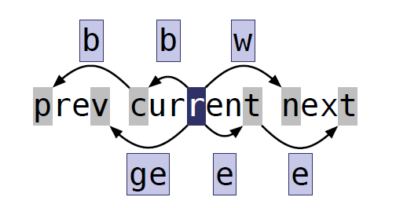
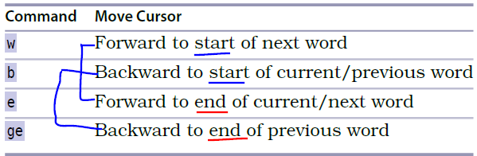
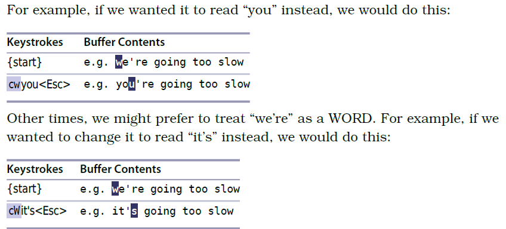

# 技巧48： 基于单词移动

### 例子：单词级别的移动
> 假设当前光标所在字符为`r`，不同按键之后光标跳转情况如下图

  

  

1. `w` 移动到下一个单词（**(for)word**)的词首
2. `b` 移动到上一个单词（**back-word**)的词首
3. `e` 移动到下一个单词（**back-word**)的词尾
4. `ge` 移动到上一个单词（**back-word**)的词尾

扩展：

1. `ea`:在单词的尾部添加
2. `gea`:在上一个单词的尾部添加

### `w`,`b`,`e` vs `W`,`B`,`E`

字串（WORD）：不含空格的连续字符串
单词（word）：字母、数字、下划线组成的连续字符串

### 例子：7个单词 vs 2个字串

  

### 例子：根据要求选择使用字串模式还是字符模式
> 下面两个替换字符串的例子，使用不同的模式按键次数不一样，粒度较小的修改使用单词模式，粒度大的修改使用字串模式

  

   

|上一篇|下一篇|
|:---|---:|
|[技巧47 区分实际行和屏幕行](tip47.md)|[技巧49 对字符串进行查找](tip49.md)|
