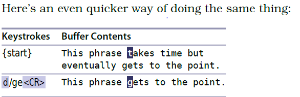

# 技巧50： 通过查找进行移动

> `f{char}` 的局限性：
> > 1. 只能找一个**字符**,不能找字符串
> > 2. 不能跨行找
> > 3. 普通的英文字符可能出现很多，单纯按一个字符查找可能没法快速定位到目的地

#### `/word<CR>` 查找字符串 `word`的下一个出现位置

1. 第一次查找完后，按`n`继续查找下一个出现位置，`N`反向查找(上一个出现位置)

### 例子：查找`ta`

  

#### 查找可以和`普通模式`，`可视模式`，`操作符待决模式`一起使用

### 例子：查找和 `可视模式` 混合使用

  

### 例子：查找和`操作符待决模式`一起使用
> 和上一个例子完成相同任务，但是更简单

  

   

|上一篇|下一篇|
|:---|---:|
|[技巧49 对字符串进行查找](tip49.md)|[技巧51 用精确的文本对象选择选取](tip51.md)|
