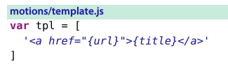
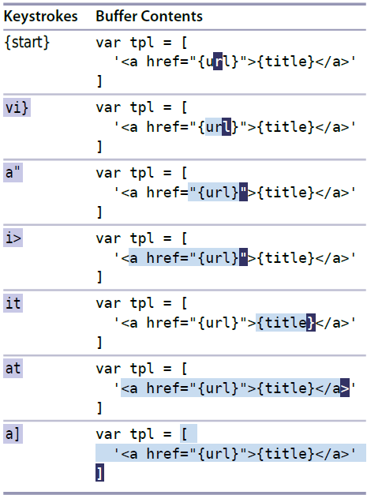
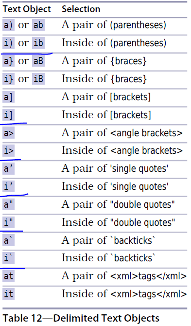
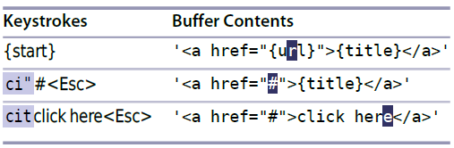

# 技巧51： 用精确的文本对象选择选取

> 怎么快速选中 _括号间的文本_,_XML标签内的文本_，_被引用的文本_ 以及其他常用文本对象？

### Vim 理解`成对出现的符号`
> vim "知道" 下图代码中的 （`{`和`}`）,(`[`和`]`), (`<`和`>`),(`<a>`和`</a>`) 是成对出现的
> 我们可以让vim**快速定位/选中/删除其文本内容**

  

### 例子：快速选中文本对象

  

1. `vi}` 快速选中`{}`之间的内容, 不包括`{`和`}` （**visual inside }**）
2. `a"` 快速选中`""`之间的内容,包括`"` (**around "**)
3. `i>` 快速选中`<>`之间的内容
4. `at` 快速选中XML标签内的内容，包括标签本身

#### Vim 的文本对象由`2`个字符组成，且第一个字符永远是`a`或`i`

`a` 包括分隔符本身(**around**)，`i` 不包括分隔符(**inside**)

#### 文本对象的例子见下表
> `a[`等价于`a]`,其他同理

  

注意：
> 1. 文本对象本身不是`动作命令`，但是可以在`可视模式`或`操作符待决模式`中使用
> 2. 一般可以使用`动作命令`的地方，也可以使用文本对象
> > 比如`d{motion}`, `c{motion}`, `y{motion}`.  

### 例子：替换html中链接地址

  

   

|上一篇|下一篇|
|:---|---:|
|[技巧50 通过查找进行移动](tip50.md)|[技巧52 删除周边，修改内部](tip52.md)|
