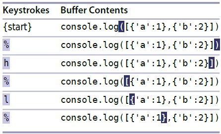
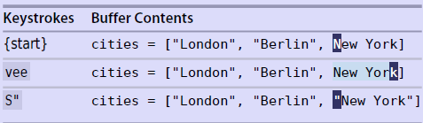

# 技巧54： 在匹配括号间跳转

> vim 可以快速在开闭括号间跳转

#### `%`运行在一组开、闭括号间跳转(`()[]{}`)
> 例子见下图:

  

### 例子：将`{}`替换成`[]`
> 如果先替换`}`，之后按`%`是跳不回`{`所在位置的,因为已经没有匹配的`{}`对了 <br>
> 可以用``` `` ```来跳回到`上一次跳转动作之前的位置`(见[技巧53](tip53.md))

  


### 例子：给选中的文本对象加分隔符
> 需要 **matchit** 插件

  

1. `cs}]` 命令可以把 `{Donghai}`改成`[Donghai]`

<br>  

|上一篇|下一篇|
|:---|---:|
|[技巧53 设置位置标记，以便快速跳回](tip53.md)|[技巧55 遍历跳转列表](../chapter9_file_jump/tip55.md)|
