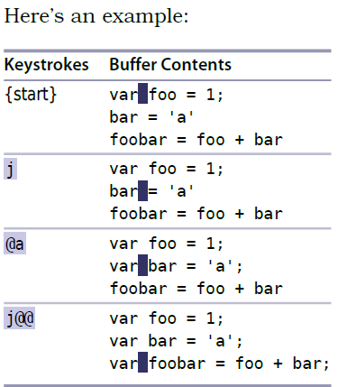

# 技巧64 宏的读取和执行

> 宏就是把一段修改序列录制下来，然后重复执行这段操作

### 例子：修改代码并将操作制作成宏

  

1. 宏以`q`开始，也已`q`结束
2. `qa`开始录制宏，并保存在寄存器`a`中
3. `:reg a`查看寄存器`a`中的内容

> 本例执行完，寄存器`a`中的内容是： 
> 

### 例子1.1： 修改代码（上个例子的继续）

  

1. `@{register}`执行制定寄存器的内容
> 本例中`@a`执行之前的操作，对第二行进行修改
2. `@@`执行最近刚**调用**的宏的命令

   

|上一篇|下一篇|
|:---|---:|
|[技巧63 与系统粘贴板进行交互](tip63.md)|[技巧65 规范光标位置、直达目标以及终止宏](tip65.md)|
