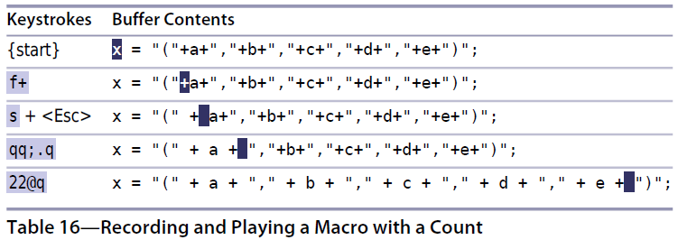

# 技巧66： 加次数回放宏
> 点范式（`.`重复操作）快速高效，缺点是不能指定次数，我们使用宏将`.`操作封装起来，这样就可以指定次数，减小按键了

### 例子：代码美化，让`+`前后都有空格
> 对于一行代码，将其`+`附近增加空格

  

1. 这个例子也可以使用`f+s+<Esc>;.;.;.;.;.;.;.;.;.`完成，一个个点太麻烦
2. `22`大于实际的`+`个数：利用宏的超过范围停止之后的指令，可以在找到最后一个后停止
3. `qq;.q` 是标记为`q`的宏，其内容是`;.`
4. 使用宏的时候其实是不需要计数的（保证执行的次数大于待处理的个数即可）

   

|上一篇|下一篇|
|:---|---:|
|[技巧65 规范光标位置、直达目标以及终止宏](tip65.md)|[技巧67 在连续的文本行上重复修改](tip67.md)|
