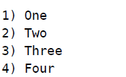
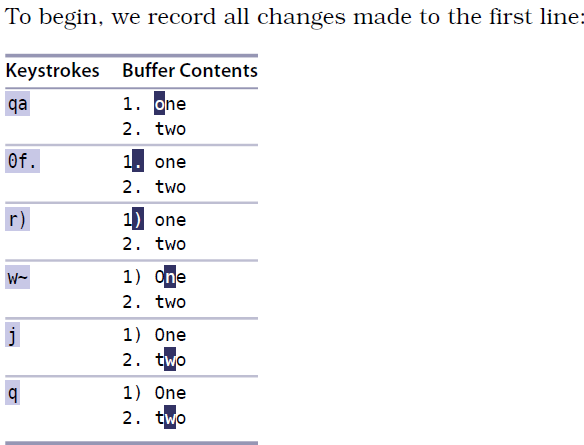
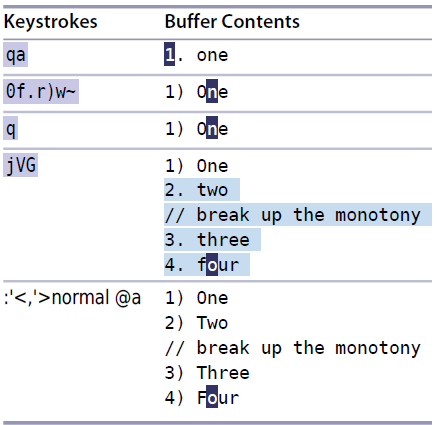

# 技巧 67： 在连续的文本行上重复修改
> 1. 对于在连续多行内进行的重复性修改，可以先录制一个宏，然后在每一行上回放
> 2. 该宏可以设计成`串行`或`并行`

### 例子：数据格式化
> 改变排序标号，首字母大写 
>    
> 变成： 
>   

#### 步骤1. 录制宏 
  

#### 步骤2. 串行方式回放宏 
  
> `0`将光标至于行首

**Note**

假设文件内容如下：

  

该方法对于上面的情况会出错, 宏遇到一个执行错误后会停止执行后面的内容

  

### 解决方法：使用并行方式执行宏
> 好处：行与行之间互相不影响 
> `并行方式`实际就是选择一段文本，制定在文本区间内同时执行

  

1. `:normal @a` 让vim在选中的每一行都执行`@a`

`并行方式`和`串行方式`没有好坏之分,分情况使用

   

|上一篇|下一篇|
|:---|---:|
|[技巧66 加次数回放宏](tip66.md)|[技巧68 给宏追加命令](tip68.md)|
