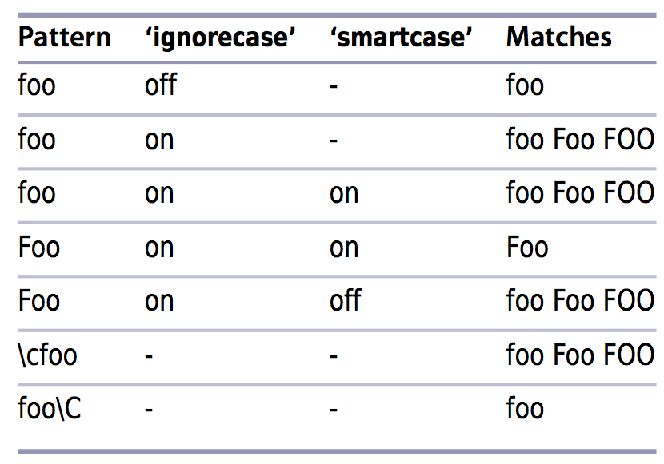

# 技巧72：调整查找模式的大小写敏感性
> 可以全局设置，也可以每次查找的时候指定

### 全局设置

在`~/.vimrc` 添加 `set ignorecase` 即可不区分大小写进行查找
> 注意：设置不区分大小写查找会影响`自动补全`效果

### 单次查找设置

查找模式下输入**`\c`XXXX**忽略大小写查找`XXXX`, **`\C`XXXX** 区分查找`XXXX`

### 智能查找

在`~/.vimrc` 添加 `set smartcase` 即可智能查找：`如果输入的单词都是小写，则使用大小写不明感查找；一旦输入的单词有一个是大写，则按照大小写敏感查找`

#### 例子:不同设置下查找模式能匹配的字符串

|上一篇|下一篇|
|:---|---:|
|[ 技巧71： 编辑宏的内容](../../part4_register/chapter11_macro/tip71.md)|[技巧73: 按正则表达式查找时，使用`\v`开关](tip73.md)|
