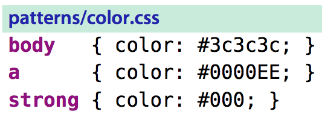

# 技巧73： 使用`\v`模式进行正则表达式查找
> 1. vim的正则表达式更接近POSIX
> 1. `\v`模式使用更接近于我们日常使用的正则表达式语法风格
> 2. `\v`=`very magic`

### 例子：使用magic模式匹配css文件中的颜色代码
> 匹配`3c3c3c`, `0000EE`, `000`

1. 满足条件的magic模式下正则表达式：`/#\([0-9a-fA-F]\{6}\|[0-9a-fA-F]\{3}\)`
> 需要非常多的转义！！
2. 使用very magic模式的正则表达式：`/\v#([0-9a-fA-F]{6}|[0-9a-fA-F]{3})`
> 基本不用写转义字符；转义字符多了肯定容易写错！
3. 优化查找(使用16进制字符类优化): `/\v#(\x{6}|\x{3})`

**very magic 模式下 `(,),|,{,}`字符变成特殊字符，表达字符凭借功能时不需要转义**

|上一篇|下一篇|
|:---|---:|
|[技巧72：调整查找模式的大小写敏感性](tip72.md)|[技巧74: 完全匹配查找时， 使用`\V`](tip74.md)|
