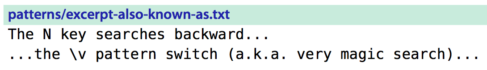

# 技巧74: 完全匹配字符串时，使用`\V` 查找
> 1. 如果我们不想使用正则表达式查找，而是`完全匹配字符串`查找，就是用`\v`
> 2. `\V` = `very nomagic`

### 例子：在下图文本里面查找 `a.k.a`
> 假设当前光标在第一行第一个字符处

1. 如果使用`/a.k.a`,则匹配到的是`backward`
  1. 因为`.`是特殊字符，能匹配任意一个字符
  2. 查找到`backward`之后按`n`建也能跳到`a.k.a`
2. 或者直接转义搜`/a\.k\.a`
3. 启用**very nomagic**模式匹配`/\Va.k.a` 可以直接搜，比上面的方便

|上一篇|下一篇|
|:---|---:|
|[技巧73： 使用`\v`模式进行正则表达式查找](tip73.md)|[技巧75: 使用`()`获取子匹配](tip75.md)|
