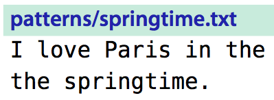

# 技巧75: 使用圆括号`()`获取子匹配
> 如果我们需要获取查找模式匹配的部分字符串，可以使用子匹配
> 子匹配和替换模式经常搭配使用：匹配某个短语，只保留其中的某一个子匹配

### 例子：去除文本中连续出现的单词

1. `/\v<(\w+)\_s+\1>`可以完成需求
  1. 上面命令中`\1`就是第一个圆括号之间匹配到的内容，表示`匹配一个单词(\w+)之后再匹配一些空格(\_s),然后再匹配前一个单词`
  2. 子匹配最多可以有9个`\1`->`\9`
  3. `\0`表示整个匹配
  4. `<`和`>`是用来匹配单词边界，可以防止**`the the`sis**被错误匹配到，`> <`本身不匹配字符，但是可以表示前、后只单词的边界（前后是空格、文章的开头、结尾什么的）

|上一篇|下一篇|
|:---|---:|
|[技巧74：完全匹配字符串时，使用`\V` 查找](tip74.md)|[技巧76: `<`,`>`界定单词边界](tip76.md)|
