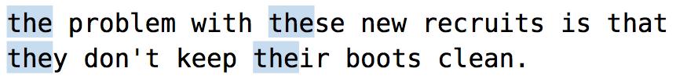

# 技巧76： 使用`<`,`>`界定单词边界

### 例子：查找句子中单词`the`的所有出现地方

1. `/the` 会错误的匹配`these`, `their`
2. `/v<the>` 可以正确匹配到所有单词the
  1. 在very magic 模式下，`<`, `>`表示单词边界
  2. `<`,`>`是`零宽度元字符`, 本身不匹配字符，仅表示**单词与围绕此单词的空白字符（或者标点符号）之间的边界**
  3. **注意：** 如果在very magic 模式下面需要匹配`<`,`>`，则需要转义(`/\v\<`)

### 补充：使用圆括号`()`但是不捕获
#### 例子：讲文本中所有的（姓+名）的形式替换成(名，姓)的形式
>假设作者叫 feipi zhe, 或者 hanpi zhe, 也就是 `((fei|han)pi zhe)`能匹配所有的名字
1. 按顺序执行下面2条指令即可
  1. `/\v(%(fei|han)pi) (zhe)`
  2. `:%s//\2,\1/g`
2. 说明：`%`表示不匹配后面的括号， 所以`\1`指的是`(%(fei|han)pi)`,`\2`指的是`(zhe)`

|上一篇|下一篇|
|:---|---:|
|[技巧75：使用圆括号`()`获取子匹配](tip75.md)|[技巧77: 界定匹配的边界(`\zs`,`\ze`的使用)](tip77.md)|
