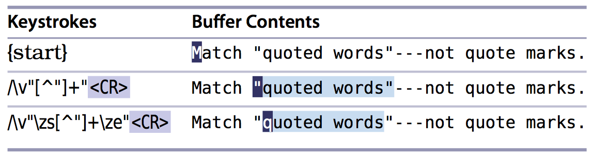

# 技巧77 界定匹配的边界（使用`\zs`, `\ze`）
> 如果我们高亮所有`three apples`中的apples，不高亮three，也不高亮其他apple，怎么办？
> `\zs`,`\ze`可以帮我处理这种情况！

1. `\zs`,`\ze`和`<`,`>`类似，都是very magic模式（`\v`)下面的`零宽度元字符`

### 例子：高亮`Practical Vim`中的`vim`
1. `/Practical Vim` 能匹配并且高亮
  1. 需要在`~/.vimrc`中开启`hlsearch`选项
  2. `Practical`也会一起被高亮，虽然他不需要被高亮！
2. `/\vPractical \zsVim`能匹配并且只高亮`vim`!
  1. `\zs`表示匹配界定的开始，`\ze`表示匹配界定的结束

### 例子： 使用`\zs`,`\ze`微调匹配的结果
> 见附图

|上一篇|下一篇|
|:---|---:|
|[技巧76： 使用`<`,`>`界定单词边界](tip76.md)|[技巧78: 转义字符](tip78.md)|
