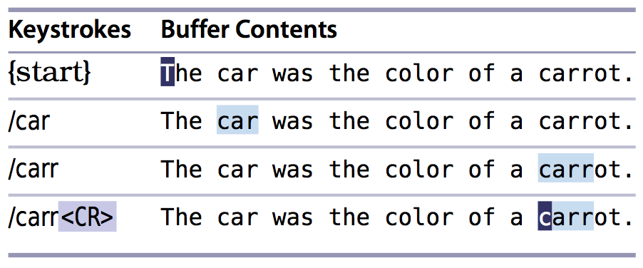

# 技巧81： 在执行查找前预览第一处匹配

1. 默认情况下我们正在输入查找模式的情况下，vim不会进行查找，只有输入`<CR>`之后才会开始查找
2. 在`~/.vimrc`中添加`set incsearch`后开启增量查找模式
    1. 该模式让vim根据已输入的文本，预览第一处匹配

### 例子：开启增量查找功能后查找`carrot`字符串

1. `增量查找功能`可以快速的查找是否存在某个字符串，对于`检查是否有匹配`的需求非常方便
2. 查找模式下的自动补全
    1. 加入我们需要查找`Antetokounmpo`(字母哥), 然后通过增量查找发现输入`Ante`之后光标已经在`Antetokounmpo`下面了，这个时候我们输入`<C-r><C-w>`可以直接把搜索框里面的内容补全为光标所在的字符串，不需要继续输入其他字符了
        1. 如果是very magic模式查找(`/v`), 则执行上面命令会变成`/vAnteAntetokounmpo`, 不可以！这时候需要先回车(确认当前查找模式),然后重新进入查找模式，直接输入`<C-r><C-w>`
        
|上一篇|下一篇|
|:---|---:|
|[技巧80： 高亮查找匹配](tip80.md)|[技巧82: 统计当前模式的匹配个数](tip82.md)|
