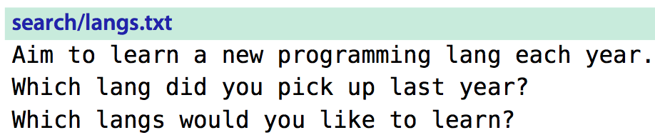

# 技巧83： 将光标偏移到查找匹配的结尾
> 我们可以设置在查找模式中每次查找时的光标距离匹配的起始或结尾指定步长的位置

### 例子：将文中所有的`lang`文本替换为全写`language`

1. 使用替换模式可以完成效果：`:%s/lang/language/g`
2. 使用查找模式+`.`模式：
    1. `/lang` 查找第一次出现， 然后输入`e`,`a`, `uage<CR>`, 之后重复按`n.`直到重复出现
    2. 会出问题：`langs`会被替换成`langsuage`,**错误！**
3. 正确的使用查找模式+`.`模式：
    1. `/lang/e` 查找第一次出现，并且光标会移动到匹配的末尾， 之后输入`a`,`uage<CR>`,然后重复`n.`即可
    2. 如果查找的时候只输入了`/lang`,处理到`langs`之后才发现问题。没关系，回退对`langs`的操作，然后输入`//e<CR>`来匹配模式

|上一篇|下一篇|
|:---|---:|
|[技巧82： 统计当前模式的匹配个数](tip82.md)|[技巧84: 对完整的查找匹配进行操作](tip84.md)|
    