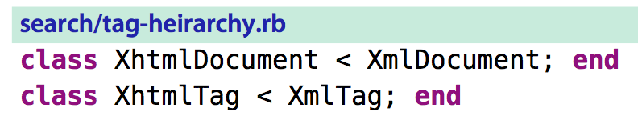

# 技巧84： 对完整的查找匹配进行操作
> 如果我们不仅要查找，还需要对匹配的内容进行替换，应该怎么操作？

### 例子： 将xml和xhtml全部变成大写

1. 方法1：每次单独操作
    1. 假设查找到了每个单词，对于XhtmlDocument, 执行`gU3l`或者`3gUl`
        1. `gU3l` 是指向右(`l`)3个字符，将其变成大写(`U`)
        2. `3gUl` 是指重复执行3次`gUl`, `gUl`是指将光标所在字符变成大写后右移光标
2. 方法2：半可重复的操作
    1. `/\vX(ht)?ml\C` 来查找xml和xhtml的所有出现， 对第一次出现，执行`gU//e`,之后重复执行`//<CR>.`
        1. `gU//e` 将光标匹配到的都变成大写，知道查找模式在当前匹配的结束(`e`)
        2. `//.` 中`//`跳到光标结束位置，`.`重复修改操作
        3. 不能用`n`跳到下次位置是因为`gU//e`修改了查找模式每次跳转之后的相对为止为文件结尾(`e`), 不能重复
3. 方法3：可重复操作
    1. `/\vX(ht)?ml\C` 来查找xml和xhtml的所有出现， 之后执行`gUfl`, 后面重复 `n.`
        1. `gUfl` 指将文本变成大写直到字符`l`
        
|上一篇|下一篇|
|:---|---:|
|[技巧83： 将光标偏移到查找匹配的结尾](tip83.md)|[技巧85: 利用查找历史，迭代完成复杂模式](tip85.md)|
    
