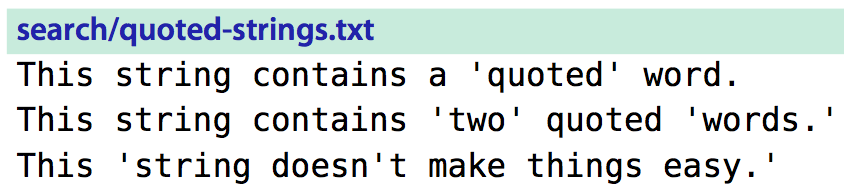
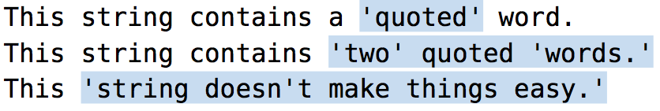
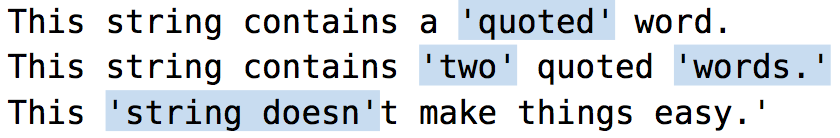

# 技巧85： 利用查找历史， 迭代完成复杂的模式
> 写一个正则表达式匹配长字符串总是复杂的过程，我们可以利用查找历史迭代的做

### 例子： 匹配所有单引号(`''`)之间的内容，并进行替换

#### 1. 先考虑匹配
1. 错误尝试1： `/\v'.+'`
    1. 结果如下，这是因为`。+`是贪心匹配，总会匹配最长的结果
    
2. 错误尝试2: `/\v'[^']+'`
    1. 结果如下，`[^']+`表示匹配非`'`的任意多个字符，但是没有办法区别`doesn't`的`'`
    
3. 正确尝试3： `/\v'([^']|'\w)+'`
    1. 可以正确匹配到样例的所有情况
    
#### 2. 匹配+替换结合

1. 执行`/\v'(([^']|'\w)+)'`
2. 执行 `:%s//“\1”/g`
    1. `\1`在命令1中已经被赋值为第一个匹配到的括号内的内容（单引号之间的内容）

#### 3. 一条语句

`:%s/\v'(([^']|'\w)+)'/“\1”/g`

#### 迭代完成

在迭代修改正则表达式匹配的过程中，我们可以通过2种方式利用前一次的结果

1. `/<Up>` 来调用上一次的匹配模式
2. (当正则表达式变得复杂时推荐)普通模式下`q/`调出命令行窗口来显示历史语句， 这样我们可以像修改文件一样来修改上一次的命令

|上一篇|下一篇|
|:---|---:|
|[技巧84： 对完整的查找匹配进行操作](tip84.md)|[技巧86: 查找当前高亮选区中的文本](tip86.md)|
    
