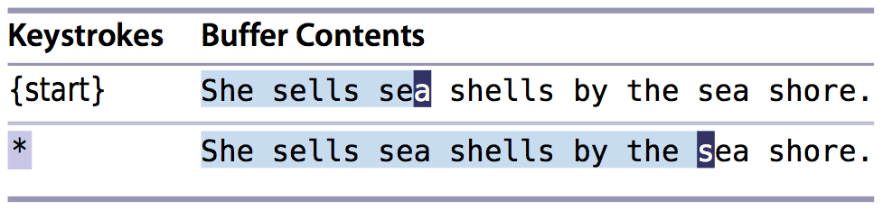

# 技巧86： 查找当前高亮选区中的文本
> 如果我们高亮选中了某段文本，怎么快速的在文章中查找该段文本？

1. 普通模式下`*`会查找当前光标所在的文本
2. 如果在可视模式(visual mode) 下， `*` 会增加选中区域到下一次出现
    > 
3. 设置键盘映射`vmap X y/<C-R>"<CR>`可以使在可视模式下输入`X`查找被选中的区域
    1. 如果选中区域含有`.*`等特殊字符， 会有问题
    2. `y/<C-r>"<CR>` = `y`(复制选中区域(到无名寄存器)) + `/`(进入查找模式) + `<C-r>"`(将无名寄存器的内容输入进来) + `<CR>`(开始查找)
        1. `<C-r>"`取出无名寄存器的内容
        2. `<C-r>%`取出当前文件名
        3. `<C-r>/`取出上一次查找到模式串（在查找模式下等价于`<Up>`)
        4. `<C-r>+`取出系统粘贴版里面的内容
        
4. 终极版本（我只是看懂大概，语法不懂），将下面的内容复制到vim脚本就可以实现可视模式下按`*`或者`#`来正向、反向查找      

```Shell
xnoremap * :<C-u>call <SID>VSetSearch()<CR>/<C-R>=@/<CR><CR> 
xnoremap # :<C-u>call <SID>VSetSearch()<CR>?<C-R>=@/<CR><CR>
function! s:VSetSearch()
let temp = @s
norm! gv"sy
let @/ = '\V' . substitute(escape(@s, '/\'), '\n', '\\n', 'g') let @s = temp
endfunction
```


    1. `VSetSearch`函数应该是将当期寄存器的内容存放到`@/`寄存器
    2. `/<C-R>=@/<CR>` 搜索`@/`寄存器的字符串
    
    
|上一篇|下一篇|
|:---|---:|
|[技巧85： 利用查找历史， 迭代完成复杂的模式](tip85.md)|[技巧87: 认识替换命令](../chapter14_substitute/tip87.md)|
        