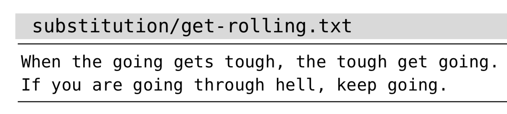

# 技巧88: 在文件范围内查找并替换每一处匹配

> 1. 不加任何标志位的substitue命令只会替换当前行、只替换第一处匹配
> 2. `g`标志位对文件的全部内容进行替换（`global`)

### 例子：将`going`替换为`rolling`
> 将下述文本中的`going`替换为`rolling`
> 

1. 不加任何标志位，只替换第一次匹配处：
> 

2. `g`标志位将当前行（光标所在行）所有的匹配都替换：
> 

3. 添加`%`前缀表示在每一行都执行该替换操作：
> 

|上一篇|下一篇|
|:---|---:|
|[技巧87：结识 substitute 命令](tip87.md)|[技巧89: 手动控制每一次替换操作](tip89.md)|
