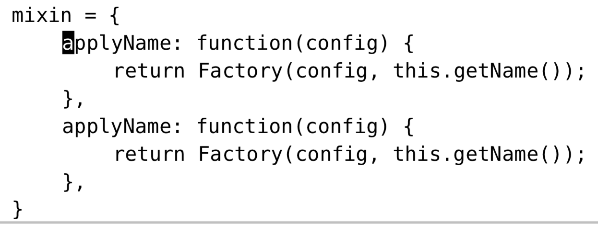

# 技巧92: 重复上一次 substitute 命令
> 有时（之前执行错了、另一个缓冲区中再执行一遍）我们需要重复执行替换命令，可以使用一些快捷方式加速

### 例子：在全局范围内执行替换操作

>假设我们想把所有的`target`替换为`replacement`，但是错误执行了`:s/target/replacement/g`。

后续我们只需要执行`g&`即可达到效果。

1. `g&`等价于`:%s//~/&`，用同样的标志位、同样的替换字符串、同样的查 找模式以及新的执行范围 %，重复上一次 substitute 命令
2. 之后遇到除了没加`%`之外，其他都对的替换命令时，之后执行`g&`即可

### 例子： 对部分区域执行替换操作
> 假设我们需要下面第二个`applyName....`的子块中的`Name`字符串替换为`Number`
> 

1. 如果我们执行`:%s/Name/Number/g`，会**错误的**把所有的`Name`替换成`Number`
2. 发生上述错误后，我们使用`u`回退，然后高亮选中第二个子块，最后执行`:'<,'>&&`即可
    1. `:&&`中第一个`&`是一个Ex命令，表示重复上一次替换命令；第二个`&`表示重复上一次替换命令的标志位
    2. 选中模式中已选择部分区域后，按`:`会自动进入`:'<,'>`,其中`'<`表示光标选中的第一行，`'>`表示光标选中
    3. 类似的，`:%&&`表示作用于整个文件

|上一篇|下一篇|
|:---|---:|
|[技巧91: 用寄存器的内容替换](tip91.md)|[技巧93: 使用子匹配重排CSV文件的字段](tip93.md)|
        
