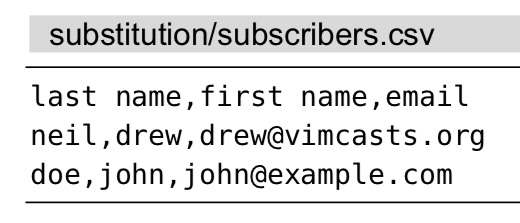

# 技巧93: 使用子匹配重排CSV文件的字段
> 本节介绍替换命令中：在替换域中使用查找模式的子匹配(减少替换域中的代码)

### 例子：交换csv文件的字段次序

> 交换这些字段的次序，即把电子邮箱放到首列，其次是名字，最后一列为姓氏

> 

执行2条指令即可：`/\v^([^,]*),([^,]*),([^,]*)$`、`:%s//\3,\2,\1`

1. `[^,]`表示匹配除`,`外的字符
2. `([^,]*)`表示匹配连续多个非`,`外的字符，并且将捕获的结果作为子匹配（子匹配就是一对小括号包含的内容）
3. `\1`,`\2`,`\3`表示第1、2、3个子匹配，在本例中分别指姓氏、名字和邮箱

|上一篇|下一篇|
|:---|---:|
|[技巧92: 重复上一次 substitute 命令](tip92.md)|[技巧94: 在替换过程中执行算术运算](tip94.md)|
