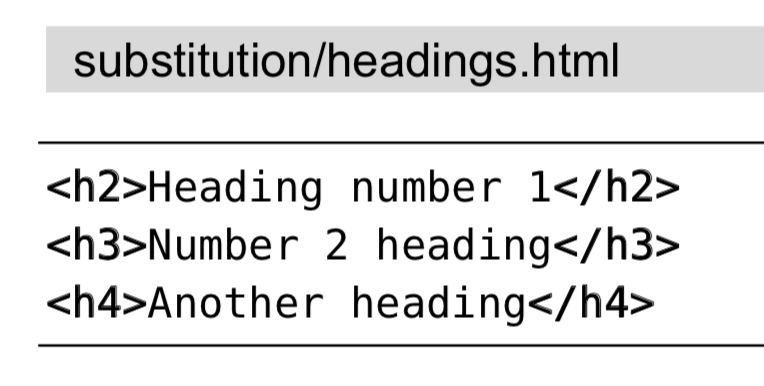

# 技巧94: 在替换过程中执行算术运算 
> 替换命令中的替换域不一定是简单的字符串，也可以是Vim脚本/表达式

### 例子: 将每一级HTML标签的层级都提升一级
> 

1. 步骤1：执行`/\v\<\/?h\zs\d`查找
    1. `\zs`表示设置匹配的开始位置。也就是说，虽然是查找`<h1`,`</h2`,但是匹配的结果会抛弃`\zs`之前的内容，也就是匹配的结果只是`1`,`2`
2. 步骤2：`:%s//\=submatch(0)-1/g` 将匹配的数字都减一

|上一篇|下一篇|
|:---|---:|
|[技巧93: 使用子匹配重排CSV文件的字段](tip93.md)|[技巧95: 交换两个或更多的单词](tip95.md)|
